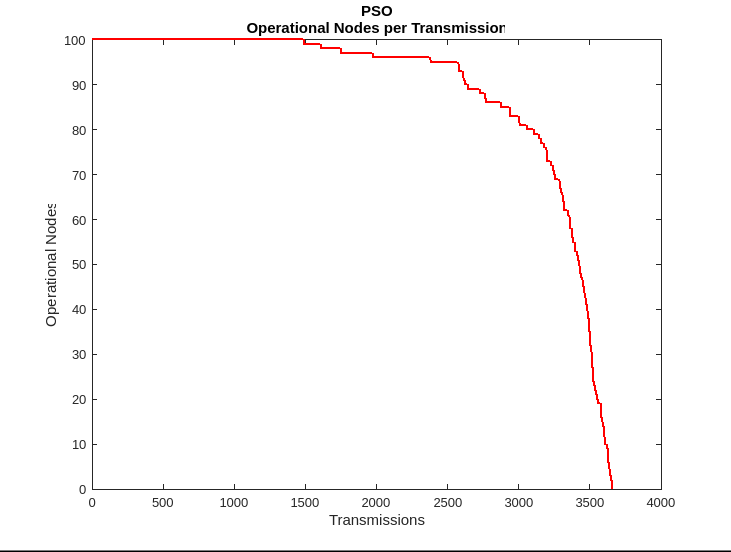
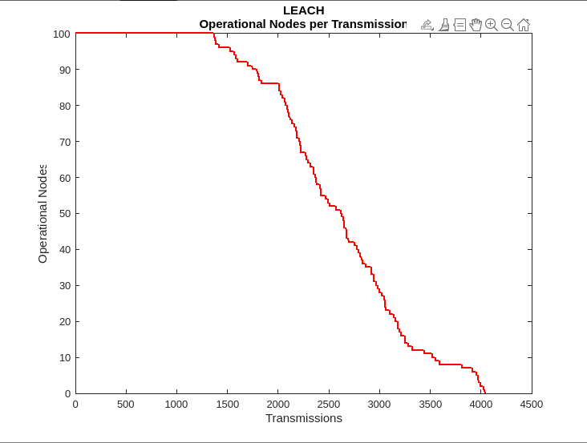
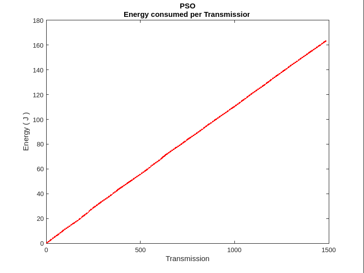
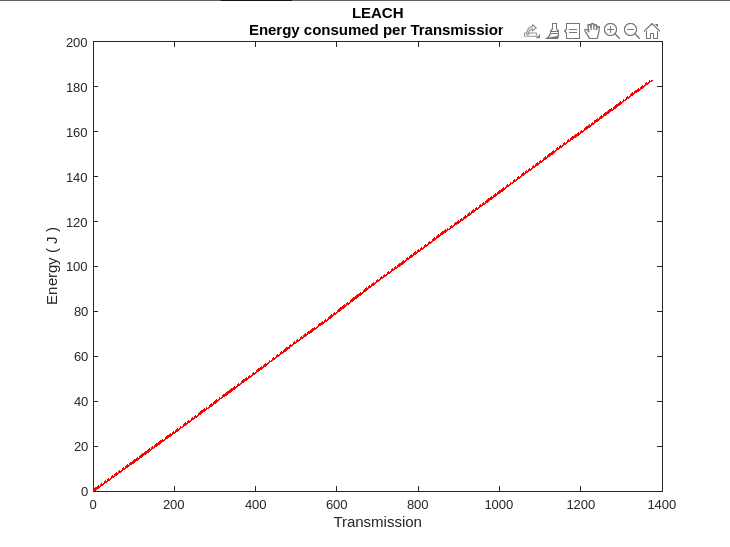
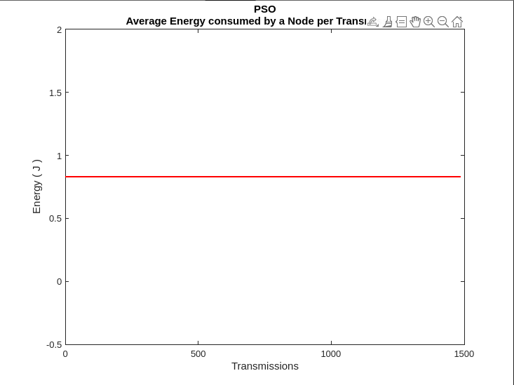
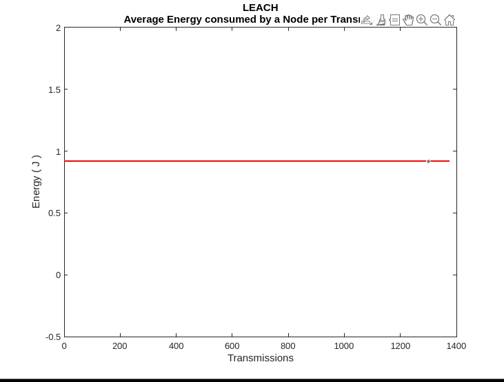

<h1> Clustering based on PSO</h1>
Particle swarm optimization (PSO) is a robust evolutionary strategy inspired by the social behavior of animal species living in large colonies like birds, ants or fish.
PSO can be applied for various optimization problems, for example, Energy-Storage Optimization. PSO can simulate the movement of a particle swarm.
Here we use Particle Swarm Optimization for CH selection.
 
 
We also use the inbuilt <b>K-means clustering ML algorithm</b> available in Matlab. This improves the efficency of PSO by initializing the start positions of particle swarm instead of starting randomly as in traditional PSO.  
 
 
This folder contains the template code for PSO 
 
Consists of 3 files:
  1. <h4>PSO_try3.m</h4> - overall code including the energy model. Plots graph of various parameters.
  2. <h4>PSO-algo.m</h4> - funtion contains the actual PSO algorithm. Called by PSO_try3.m after a number of rounds(hyperparameter).
  3. <h4>calcfitness.m</h4> - function calculates fitness depending on all the WSN parameters considered. Called by PSO-algo.m each iteration.
Results obtained as per simulations in Matlab
 
 

 

 

 
