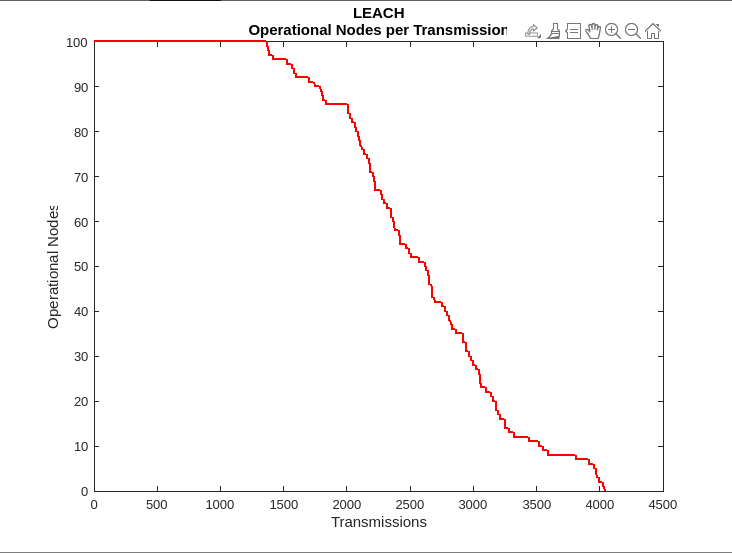

This folder contains the template code for PSO 
 
 

Consists of 3 files:
  1. <h4>PSO_try3.m</h4> - overall code including the energy model. Plots graph of various parameters.
  2. <h4>PSO-algo.m</h4> - funtion contains the actual PSO algorithm. Called by PSO_try3.m after a number of rounds(hyperparameter).
  3. <h4>calcfitness.m</h4> - function calculates fitness depending on all the WSN parameters considered. Called by PSO-algo.m each iteration.
Results obtained as per simulations in Matlab
 
<h3>PSO-algorithm </h3>

